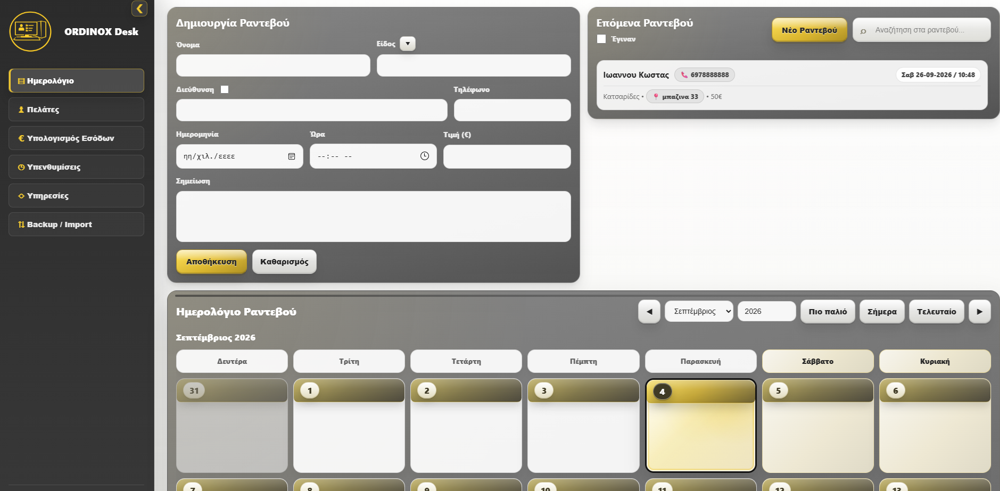
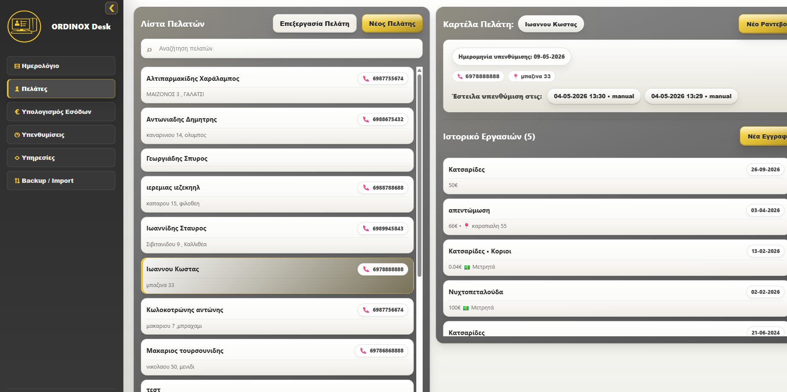
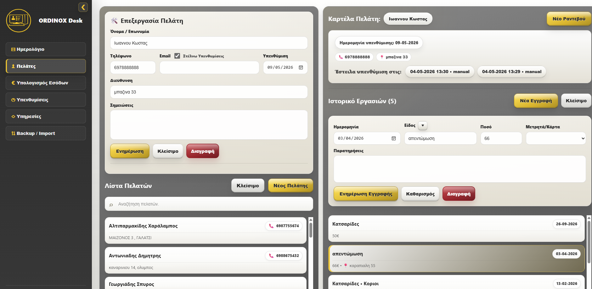
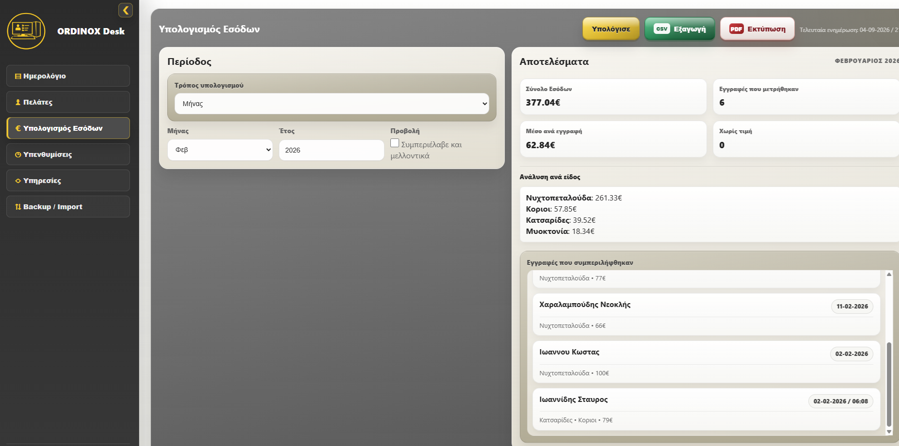
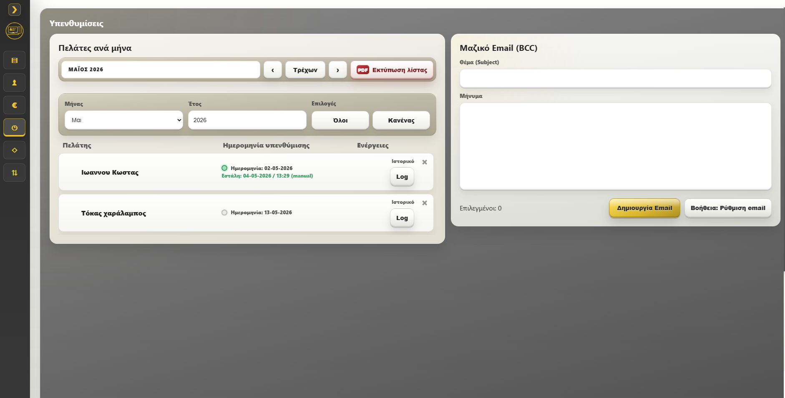
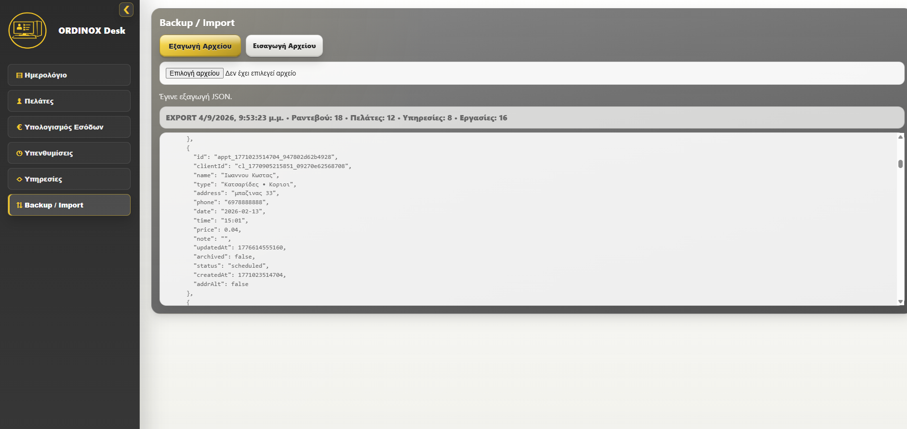

# Ordinox Desk

[English](README.md) · [Ελληνικά](README_GR.md)

**Local-first desktop client and business management application for Windows.**

Ordinox Desk is a Windows desktop application designed to help small businesses manage clients, appointments, services, revenue, reminders and everyday business workflows from a single interface.

The project started as an initial idea and was developed iteratively into a functional desktop application, with a strong focus on usability, structured data management, reliability and practical day-to-day operation.

---

## Tech Stack

- **Tauri 2** — Rust-based desktop application framework and Windows packaging
- **Vanilla JavaScript** — application logic and state management
- **HTML5** — application structure
- **CSS3** — custom user interface and desktop layout
- **WebView localStorage** — local application data persistence
- **JSON** — backup and data import/export
- **Windows desktop packaging** — standalone application and installer generation

Ordinox Desk is a **local-first application**.

Its main business logic is implemented in JavaScript, while Tauri provides the native Windows application shell and packaging layer.

The application does not require a remote backend or database server for its normal operation.

---

## Application Preview

### Calendar & Appointment Management

The application includes a complete appointment management workflow with:

- New appointment creation
- Date and time management
- Client information
- Service selection
- Price tracking
- Notes
- Appointment search
- Upcoming appointments
- Calendar-based navigation
- Appointment status management

---

### Client Management

Ordinox Desk includes a structured client management system designed for quick access to customer information and related business activity.

Features include:

- New client creation
- Client editing
- Client search
- Organized client list
- Client-related information
- Access to previous activity
- Quick access to relevant actions and records

---

### Client Details

Each client can have a dedicated record containing relevant information and business history.

The goal is to keep useful client information accessible from one place instead of relying on multiple applications, documents or spreadsheets.

---

### Revenue Management

The application includes tools for organizing and reviewing revenue-related information.

This provides a practical overview of financial information associated with appointments, services and business activity.

---

### Reminders

A dedicated reminder system helps users keep track of important tasks and obligations directly inside the application.

This allows business-related reminders to remain connected to the rest of the workflow instead of requiring a separate application.

---

### Services

Ordinox Desk includes service management functionality, allowing commonly provided services to be organized and reused throughout the application.

This reduces repetitive data entry and helps maintain consistency across appointments and client activity.

---

### Backup & Import

Data portability and recovery were important parts of the project.

The application includes functionality for:

- Data backup
- JSON data export
- Data import
- Validation and normalization of imported data
- Recovery of stored information
- Protection against invalid or unexpected imported data

The application stores its working data locally, allowing normal operation without requiring a remote server.

---

## Windows Desktop Application

Ordinox Desk runs as a standalone Windows desktop application using **Tauri 2**.

The project includes configuration for:

- Native Windows application execution
- Application identity and branding
- Application icons
- Release builds
- Windows packaging
- Installer generation

The user interface and business logic are built with Vanilla HTML, CSS and JavaScript, while Tauri provides the native desktop runtime and packaging environment.

This allows Ordinox Desk to be installed and used like a normal Windows application rather than requiring the user to manually open web files or run a development environment.

---

## Local-First Architecture

Ordinox Desk was designed to work locally on the user's computer.

For normal operation:

- No remote backend is required
- No external database server is required
- Application data is stored locally
- Backup files can be exported by the user
- Existing data can be restored through the application's import workflow

This architecture keeps the application simple to deploy and suitable for standalone business use.

---

## Development Approach

Ordinox Desk was developed incrementally rather than through large one-time rewrites.

The development process includes:

1. Understanding the existing behavior
2. Planning the required feature or fix
3. Implementing the smallest appropriate change
4. Reviewing the affected code
5. Running and testing the application
6. Checking existing functionality for regressions
7. Refining the user interface where necessary
8. Avoiding unrelated modifications

This approach became particularly important as the project grew and more features began interacting with the same application state and data.

---

## AI-Assisted Development

AI-assisted software development is an important part of my workflow, particularly using **OpenAI Codex**.

AI tools are used for tasks such as:

- Existing code analysis
- Feature implementation
- Debugging
- Identifying potential issues
- Code refinement
- Investigating alternative implementations
- Reviewing the possible impact of changes
- Assisting with testing and validation
- Understanding interactions between existing features

AI-generated changes are not applied blindly.

Changes are reviewed and tested incrementally, with particular attention to preserving existing behavior and avoiding unrelated modifications.

My workflow combines AI-assisted implementation with human review, testing, debugging and product decisions.

---

## Data Handling & Reliability

As the application evolved, particular attention was given to handling local business data safely and predictably.

The project includes logic for areas such as:

- Input validation
- Data normalization
- Backup and import workflows
- Recovery from malformed stored data
- Escaping user-controlled values before rendering in multiple UI areas
- Safer CSV-compatible data handling
- Rollback behavior when certain persistence operations fail

These mechanisms were added progressively as real application workflows became more complex.

---

## What I Learned From This Project

Developing Ordinox Desk has given me practical experience in:

- Building a complete desktop application from an initial idea
- Designing application workflows
- Client and business data management
- Application state management
- Local data persistence
- HTML, CSS and Vanilla JavaScript application development
- UI/UX design and refinement
- Debugging and troubleshooting
- Feature implementation
- Regression checking
- Data validation
- Backup and recovery workflows
- Tauri desktop application configuration
- Windows application packaging
- Installer preparation
- Iterative product development
- AI-assisted software development
- Using Codex as part of a real development workflow

---

## Project Structure

The application uses a web-based frontend running inside the Tauri desktop environment.

The main application is organized around:

- HTML for application structure
- CSS for the custom desktop interface
- JavaScript for business logic, state and user interactions
- Tauri configuration for the native application environment
- Rust/Tauri bootstrap code for the desktop shell
- Local storage and JSON-based backup workflows for data persistence and portability

The majority of the application's business logic is implemented in JavaScript.

---

## Test Data & Privacy

All names, telephone numbers, appointments and other personal information visible in the screenshots in this repository are **fictional test data**.

They do not represent real clients or individuals.

No production client data is included in this portfolio repository.

---

## Source Code

The full production source code of Ordinox Desk is currently maintained privately.

This repository is intended as a **project showcase and portfolio presentation**, containing documentation and visual material demonstrating the application's functionality and development process.

The complete source code is not included in this showcase repository.

Additional technical material or source access may be provided when appropriate.

---

## Project Status

**Active personal software project.**

Ordinox Desk is a functional Windows desktop application and continues to evolve through additional features, fixes, code improvements and usability refinements.
